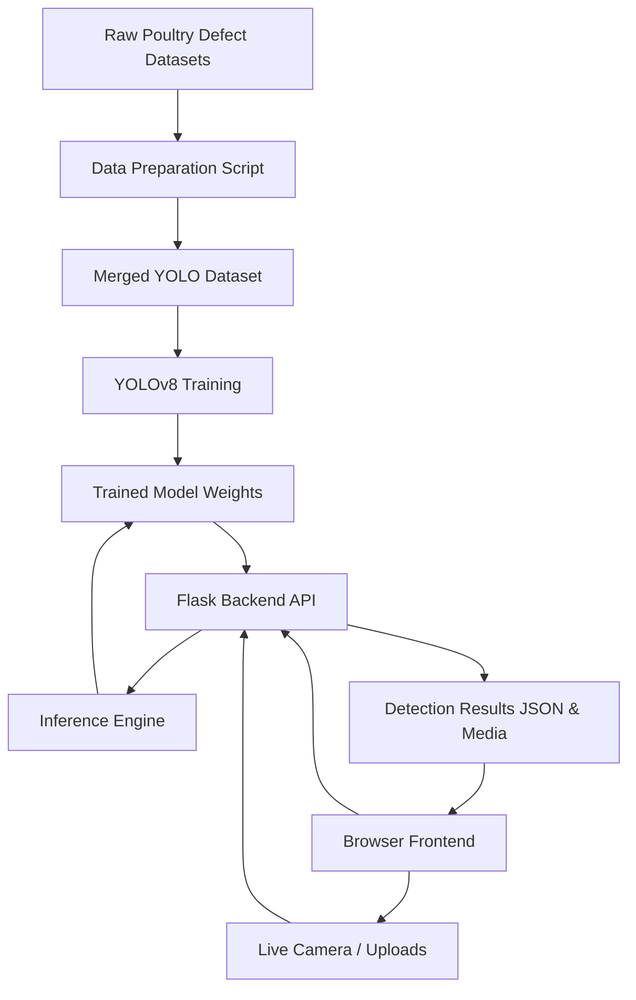

# Poultry Carcass Defect Detection

An AI-powered web application for detecting and classifying defects on poultry carcasses. Built with Flask, Ultralytics YOLOv8, and OpenCV, this system processes both images and videos to identify defects in real-time, helping to automate quality control in poultry processing.

## 🌟 Features

- **Image & Video Inference**: Upload single images or video files for automated defect detection.
- **YOLOv8 Powered**: Uses a fine-tuned YOLOv8 model for fast, accurate object detection and tracking.
- **Defect Tracking**: Detects and logs 11 different classes of carcass defects.
- **Web Dashboard**: Interactive web interface for uploading media, adjusting confidence/IoU thresholds, and viewing results.
- **Analytics Database**: Logs detections into a local SQLite database (`analytics.db`) for tracking statistics over time.

## 🧩 System Architecture & Modules

The system is composed of several interdependent modules:

1. **Data Preparation (`prepare_yolov8_dataset.py`)**: Consolidates raw datasets, normalizes bounding box annotations, and generates a unified `data.yaml` for YOLOv8 training.
2. **Model Training & Export (`YOLOv8_model.ipynb`, `export_models.py`)**: Trains the Ultralytics YOLOv8 model and exports PyTorch weights (`.pt`) to optimized formats (`.onnx`) for faster inference.
3. **Backend API (`web/backend/app.py`)**: A Flask-based REST API handling synchronous image uploads, asynchronous video processing (via background threads), and webcam streams.
4. **Inference Engine (`web/backend/inference.py`)**: Interacts with the trained YOLOv8 model to execute object detection and tracking, converting payloads between base64, OpenCV arrays, and JSON outputs.
5. **Analytics & Persistence (`web/backend/db.py`)**: Uses an embedded SQLite database (`analytics.db`) to record unique defects (avoiding duplicates using YOLO's object tracker) and aggregates statistics.
6. **Frontend Interface (`web/index.html`)**: A responsive UI built with HTML/CSS and vanilla JS that interacts asynchronously with the API endpoints.



## 🏷️ Defect Classes Detected

The model is trained to identify the following defects:
- Bile
- Bruise
- Dislocation
- Feather
- Fracture
- Hematoma
- Scratch
- Skin Rash
- Abnormal Carcass
- Technical Failure
- Fecal Contamination

## 🛠️ Tech Stack

- **Backend**: Python, Flask, SQLite
- **Computer Vision**: Ultralytics YOLOv8, OpenCV, NumPy
- **Frontend**: HTML5, Vanilla CSS, Vanilla JavaScript

## 🚀 Installation & Setup

### Prerequisites
- Python 3.8+
- Git

### 1. Clone the Repository
```bash
git clone https://github.com/sivarajs24/Poultry_Carcass_Defect_Detection.git
cd Poultry_Carcass_Defect_Detection
```

### 2. Create and Activate a Virtual Environment
**Windows:**
```powershell
python -m venv .venv
.\.venv\Scripts\activate
```

**macOS/Linux:**
```bash
python3 -m venv .venv
source .venv/bin/activate
```

### 3. Install Dependencies
```bash
pip install -r requirements.txt
```

*(Note: Ensure your trained model weights are located in `runs/poultry_carcass_yolo26_detect/weights/` so the backend can load them successfully).*

## 🏃‍♂️ Running the Application

Start the Flask server from the root directory:
```bash
python run_server.py
```
Once the server is running, open your web browser and navigate to:
**http://127.0.0.1:5000**

## ⚙️ Configuration

You can adjust the default confidence and IoU thresholds inside `web/backend/config.py`:
- `DEFAULT_CONF = 0.15` (Lower values allow the model to pick up less confident detections)
- `DEFAULT_IOU = 0.45` 

## 📁 Project Structure

```text
Poultry_Carcass_Defect_Detection/
├── docs/                       # Diagrams, presentations, and documentation
├── tests/                      # Unit and integration tests
├── web/
│   ├── backend/                # Flask logic, database, inference, config
│   ├── static/                 # Frontend assets (CSS, JS)
│   └── index.html              # Main Web UI
├── requirements.txt            # Python dependencies
├── run_server.py               # Main entry point to launch the Flask app
└── README.md                   # Project documentation
```
