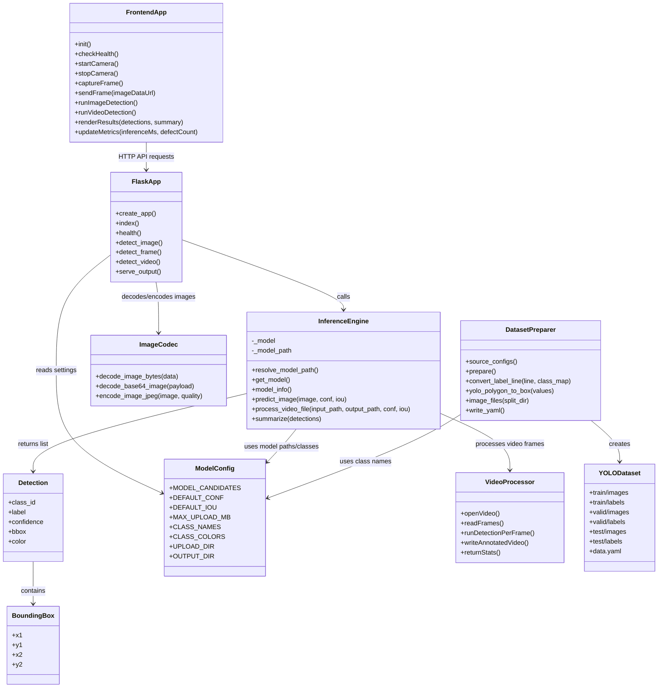

# Class Diagram

This project is mostly function-based rather than object-oriented. The following class diagram represents the main logical components, modules, and data objects.

```mermaid
classDiagram

class FlaskApp {
  +create_app()
  +index()
  +health()
  +detect_image()
  +detect_frame()
  +detect_video()
  +serve_output()
}

class InferenceEngine {
  -_model
  -_model_path
  +resolve_model_path()
  +get_model()
  +model_info()
  +predict_image(image, conf, iou)
  +process_video_file(input_path, output_path, conf, iou)
  +summarize(detections)
}

class ImageCodec {
  +decode_image_bytes(data)
  +decode_base64_image(payload)
  +encode_image_jpeg(image, quality)
}

class Detection {
  +class_id
  +label
  +confidence
  +bbox
  +color
}

class BoundingBox {
  +x1
  +y1
  +x2
  +y2
}

class ModelConfig {
  +MODEL_CANDIDATES
  +DEFAULT_CONF
  +DEFAULT_IOU
  +MAX_UPLOAD_MB
  +CLASS_NAMES
  +CLASS_COLORS
  +UPLOAD_DIR
  +OUTPUT_DIR
}

class DatasetPreparer {
  +source_configs()
  +prepare()
  +convert_label_line(line, class_map)
  +yolo_polygon_to_box(values)
  +image_files(split_dir)
  +write_yaml()
}

class FrontendApp {
  +init()
  +checkHealth()
  +startCamera()
  +stopCamera()
  +captureFrame()
  +sendFrame(imageDataUrl)
  +runImageDetection()
  +runVideoDetection()
  +renderResults(detections, summary)
  +updateMetrics(inferenceMs, defectCount)
}

class VideoProcessor {
  +openVideo()
  +readFrames()
  +runDetectionPerFrame()
  +writeAnnotatedVideo()
  +returnStats()
}

class YOLODataset {
  +train/images
  +train/labels
  +valid/images
  +valid/labels
  +test/images
  +test/labels
  +data.yaml
}

FlaskApp --> InferenceEngine : calls
FlaskApp --> ImageCodec : decodes/encodes images
FlaskApp --> ModelConfig : reads settings
InferenceEngine --> ModelConfig : uses model paths/classes
InferenceEngine --> Detection : returns list
Detection --> BoundingBox : contains
InferenceEngine --> VideoProcessor : processes video frames
FrontendApp --> FlaskApp : HTTP API requests
DatasetPreparer --> ModelConfig : uses class names
DatasetPreparer --> YOLODataset : creates
```

