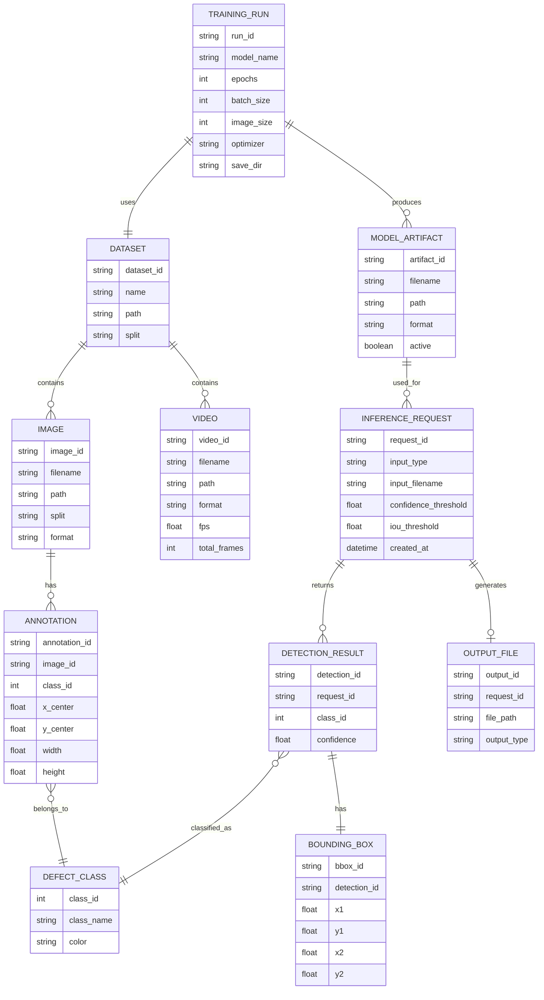

# Entity Relationship Diagram

The current project does not use a database. It uses file-based storage for datasets, trained models, uploads, and outputs. This ER diagram is a conceptual database model for the system.

