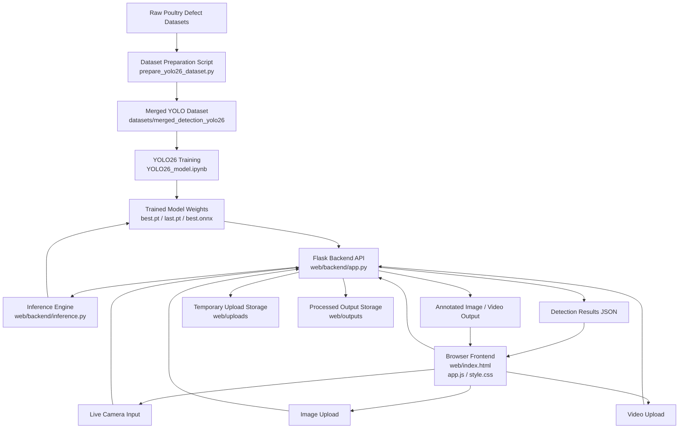

# System Architecture Diagram

```mermaid
flowchart TD
    A[Raw Poultry Defect Datasets] --> B[Dataset Preparation Script<br/>prepare_yolo26_dataset.py]

    B --> C[Merged YOLO Dataset<br/>datasets/merged_detection_yolo26]
    C --> D[YOLO26 Training<br/>YOLO26_model.ipynb]

    D --> E[Trained Model Weights<br/>best.pt / last.pt / best.onnx]

    E --> F[Flask Backend API<br/>web/backend/app.py]

    G[Browser Frontend<br/>web/index.html<br/>app.js / style.css] --> F

    F --> H[Inference Engine<br/>web/backend/inference.py]
    H --> E

    G --> I[Live Camera Input]
    G --> J[Image Upload]
    G --> K[Video Upload]

    I --> F
    J --> F
    K --> F

    F --> L[Detection Results JSON]
    F --> M[Annotated Image / Video Output]

    L --> G
    M --> G

    F --> N[Temporary Upload Storage<br/>web/uploads]
    F --> O[Processed Output Storage<br/>web/outputs]
```

